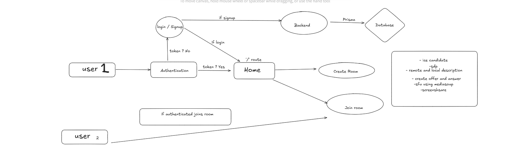

## Project Setup

```bash
cd backend
npm install

cd frontend
npm install
```

## About the project

We are creating a video chat application using the following technologies:

-   Typescript
-   Node.js
-   Express
-   websocket
-   Mediasoup
-   React
-   Tailwind CSS
-   WebRTC
-   Postgres
-   Prisma

## Project Structure

-   `backend`: Contains the server code.
-   `frontend`: Contains the client code.

## Logic 
 
